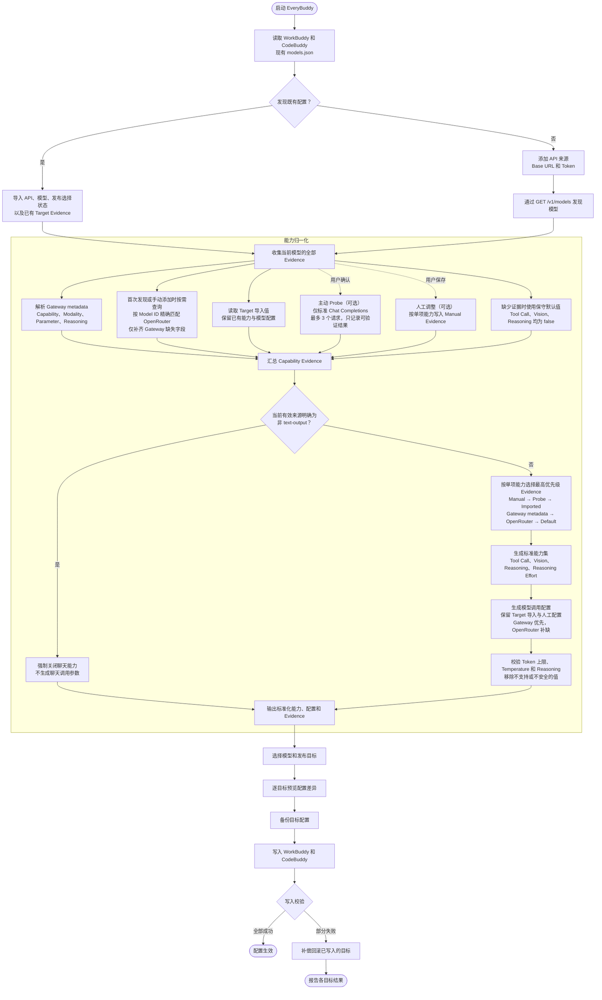

<div align="center">


# EveryBuddy

[](https://react.dev/) [](https://www.typescriptlang.org/) [](https://www.rust-lang.org/) [](https://tauri.app/) [](LICENSE)

**面向 WorkBuddy 与 CodeBuddy 的 OpenAI-compatible 模型配置管理桌面应用**

</div>

EveryBuddy 是一款面向个人开发者的开源桌面应用，用于管理多个 OpenAI-compatible API 来源，并把选中的模型配置发布到 WorkBuddy、CodeBuddy 或同时发布到两个产品。

> 当前开发版本为 `0.1.0-alpha.1`。发布操作会备份并校验目标配置，但仍建议把现有 `models.json` 纳入本机备份。


## 核心流程



主动 Probe 和人工调整都会新增独立的 Capability Evidence，并重新执行能力归一化。它们的优先级高于自动来源，但不能绕过非 text-output 硬约束。

## 工作方式

1. 添加 API Base URL 和 Bearer Token。Token 保存到 macOS Keychain 或 Windows Credential Manager。
2. 通过 `GET /v1/models` 发现模型。如果 API 没有返回所需模型，可以在该 API 来源下手动添加。
3. 检查模型能力和参数。EveryBuddy 会匹配 OpenRouter 公开模型目录，也支持主动 Probe 和人工调整。
4. 选择 WorkBuddy、CodeBuddy 或两个目标，预览差异后发布。
5. 发布前自动备份目标配置。双目标发布发生部分失败时，EveryBuddy 会恢复已经写入的目标，并报告每个目标的结果。

EveryBuddy 启动时会读取两个目标已有的 `models.json`。API 来源不存在时，应用会创建对应来源并导入模型；API 来源已经存在时，只匹配模型和发布选择状态，不覆盖本地模型配置。未选中的模型只会从本次发布中排除，不会从 WorkBuddy 或 CodeBuddy 中删除。

## 主要功能

- 同时管理多个 API 来源，每个来源独立保存模型和凭据引用。
- 自动发现模型，也可手动添加 API 未返回的模型。
- 配置 Tool Call、Vision、Reasoning、Reasoning Effort 和高级模型参数。
- 发布完整的 WorkBuddy、CodeBuddy 模型字段，包括 Token 上限、Temperature、Reasoning 配置和 Custom Protocol 设置。
- 分别发布到 WorkBuddy、CodeBuddy，或使用补偿式事务同时发布到两个目标。
- 发布前预览新增和更新内容，保留未知字段，并检测外部配置变化。
- 为每个目标保留最近 10 份备份，支持查看和恢复。
- 支持简体中文、English，以及 Light、Dark、System 主题。

## 发布前预览

发布前会逐目标展示新增、更新和不变的模型数量。存在 Model ID 冲突时，需要明确确认是否使用当前 API 来源替换目标中的同名模型。


## API 兼容要求

EveryBuddy 首版支持使用 Bearer Token 的 OpenAI-compatible API：

| 项目       | 要求                              |
| ---------- | --------------------------------- |
| 模型发现   | `GET {apiRoot}/models`            |
| 主动 Probe | `POST {apiRoot}/chat/completions` |
| 认证       | `Authorization: Bearer {token}`   |
| 远程 API   | 必须使用 HTTPS                    |
| 本机 API   | loopback 地址可以使用 HTTP        |

本机 loopback 地址包括 `localhost`、`127.0.0.1` 和 `::1`。API Base URL 可以填写域名根地址、`/v1` API Root 或完整的 `/v1/models` 地址，EveryBuddy 会统一转换为 API Root。首版不支持非 Bearer 认证，也不对非 OpenAI-compatible 协议作兼容承诺。

## 模型能力与思考强度

模型能力按以下优先级解析：人工设置、成功的主动 Probe、已有目标配置的导入值、API 返回的 Gateway metadata、OpenRouter、保守默认值。Gateway 或 OpenRouter 明确标记为非 text-output 的模型始终不投影聊天能力，Probe、导入记录或人工设置不能将其重新启用。Probe 只在用户确认后执行，一次最多发送 3 个最小请求，可能产生少量 Token 消耗。

EveryBuddy 在首次模型发现或手动添加模型时按需读取 OpenRouter 公开模型目录。请求不会携带用户 Token、API Base URL 或 API metadata。成功结果会在本机缓存 6 小时；请求失败后 15 分钟内不重复请求。

OpenRouter 明确返回 `reasoning.supported_efforts` 时，EveryBuddy 会将其中的 `minimal`、`low`、`medium`、`high`、`xhigh` 和 `max` 写入 `reasoning.supportedEfforts`。`none` 表示允许关闭思考，不作为强度档位写入；`reasoning.default_effort` 和 `reasoning.mandatory` 分别映射为默认思考强度和是否允许关闭思考。OpenRouter 没有返回明确范围时，EveryBuddy 不会仅凭 `reasoning_effort` 参数名称推测具体档位。

OpenRouter 还会补齐 Gateway metadata 缺失的最大输入 Token、最大输出 Token、非空默认 Temperature 和 Reasoning 信息。Gateway 明确返回的字段优先；已有 Target 导入配置和人工设置也不会被自动匹配覆盖。

同一模型存在基础记录、Batch/Free 变体、Alias 或带日期的 Canonical slug 时，EveryBuddy 优先使用完整 Model ID 对应记录的明确字段，只用关联的基础记录补齐缺失字段；只有查询的 Canonical slug 没有精确记录时才解析到基础记录。匹配不使用前缀模糊规则，因此 `openai/gpt-5.6-sol` 和 `openai/gpt-5.6-sol-pro` 始终独立。发布时保留 Gateway 实际返回的 Model ID。非 text-output 模型不会被错误映射为 WorkBuddy/CodeBuddy 的聊天参数；旧版 OpenRouter 匹配记录缺少 text-output eligibility 时按未验证处理，刷新模型后才重新投影聊天能力。

Vision Probe 使用固定四色条 challenge，文本提示不包含答案，并且只有响应准确返回预期顺序时才确认图片能力。重新 Probe 会替换旧 Probe Evidence；修改 `endpointOverride` 或切换 `useCustomProtocol` 也会移除旧 Evidence。Custom Protocol 必须配置完整 `endpointOverride`，发布时不追加 `/v1` 或 `/chat/completions`，因此不执行基于 Chat Completions 的能力 Probe。旧版曾把 Custom Protocol 地址归一化为 API Root，升级后会清空这类历史地址，必须重新填写完整请求 URL。WorkBuddy 5.3.14 runtime 的 Reasoning Summary 仅接受 `auto`、`concise`、`detailed`；历史数据库中的 `always`、`never` 仍可读取，但必须改成受支持值后才能保存或发布。

## 配置目标

| 平台    | WorkBuddy                              | CodeBuddy                              |
| ------- | -------------------------------------- | -------------------------------------- |
| macOS   | `~/.workbuddy/models.json`             | `~/.codebuddy/models.json`             |
| Windows | `%USERPROFILE%\.workbuddy\models.json` | `%USERPROFILE%\.codebuddy\models.json` |

EveryBuddy 支持模型数组和包含 `models` 数组的旧包装格式。更新已有模型时，应用会保留未知顶层字段、未知模型字段和未知 Reasoning 字段。写入前如果检测到其他程序修改了目标文件，本次发布会停止并要求重新加载差异。

WorkBuddy 与 CodeBuddy 使用不同配置路径，但共享同一套序列化规则；同一次双目标发布写入的模型配置内容一致。

## Token 安全边界

EveryBuddy 不把明文 Token 写入 SQLite、诊断日志或前端持久化状态。WorkBuddy 和 CodeBuddy 的配置协议要求 `models.json` 包含明文 `apiKey`，因此发布模型时必须把 Token 写入目标配置。目标配置的备份也可能包含相同 Token。

不要把目标配置、备份或未经检查的诊断日志提交到 Git、上传到公开附件，或存放在不受保护的同步目录。详细边界和日志位置见 [SECURITY.md](SECURITY.md) 与[故障排查](docs/TROUBLESHOOTING.md)。

## 下载安装

- macOS 12 或更高版本，发布包同时支持 Apple Silicon 和 Intel。
- Windows 10 或更高版本，Alpha 阶段提供 x64 安装包。

首个 Alpha 安装包发布后，可从 [GitHub Releases](https://github.com/myxiaoao/everybuddy/releases) 下载。安装包暂未使用 Apple Developer ID 或 Windows Authenticode 平台签名，macOS Gatekeeper 和 Windows SmartScreen 会显示未验证开发者警告。

只从本仓库下载安装包，并使用 Release 中的 `SHA256SUMS.txt` 校验文件：

- macOS：把 `EveryBuddy.app` 移动到「应用程序」目录后，先在 Finder 中对应用选择「打开」，或在「系统设置 → 隐私与安全性」中确认打开。如果 Gatekeeper 仍然阻止启动，并且已经完成 SHA-256 校验，执行：

  ```bash
  sudo xattr -cr "/Applications/EveryBuddy.app"
  open "/Applications/EveryBuddy.app"
  ```

  `xattr -cr` 会递归清除应用包的扩展属性。不要把命令目标改成 `/Applications` 或其他目录。

- Windows：在 SmartScreen 中选择「更多信息 → 仍要运行」。

Tauri Updater 资产使用独立 Ed25519 key 签名，更新客户端不会接受签名校验失败的文件。GitHub 的 `releases/latest` 不会选择 Prerelease，因此 Alpha 阶段需要从 Releases 页面手动下载更新。正式发行前仍需补充 Apple notarization 和 Windows Authenticode。

## 本地开发

前置条件：

- Node.js `22.12.0` 至 `24.x`。
- pnpm `11.22.0`。
- Rust `1.91.1`。仓库中的 `rust-toolchain.toml` 会安装 `rustfmt` 和 `clippy`。
- 当前平台的 [Tauri prerequisites](https://v2.tauri.app/start/prerequisites/)。

启动桌面应用：

```bash
pnpm install --frozen-lockfile
pnpm tauri dev
```

只启动浏览器 UI Demo：

```bash
pnpm dev
```

打开 `http://localhost:1420/?demo=1`。Demo 使用本地模拟数据，不访问目标配置、API 或系统凭据库。

## 验证

```bash
pnpm verify
pnpm tauri build
```

## 项目文档

- [技术设计](docs/TECHNICAL_DESIGN.md)
- [UI 设计](docs/UI_DESIGN.md)
- [安全策略](SECURITY.md)
- [故障排查](docs/TROUBLESHOOTING.md)
- [贡献指南](CONTRIBUTING.md)
- [发布流程](RELEASING.md)
- [变更记录](CHANGELOG.md)

## 项目声明

EveryBuddy 是非官方社区项目，与 WorkBuddy、CodeBuddy 及其开发者没有隶属或合作关系。文档和界面中出现的第三方产品名、商标和 Logo 归各自权利人所有。

## License

[MIT](LICENSE)
