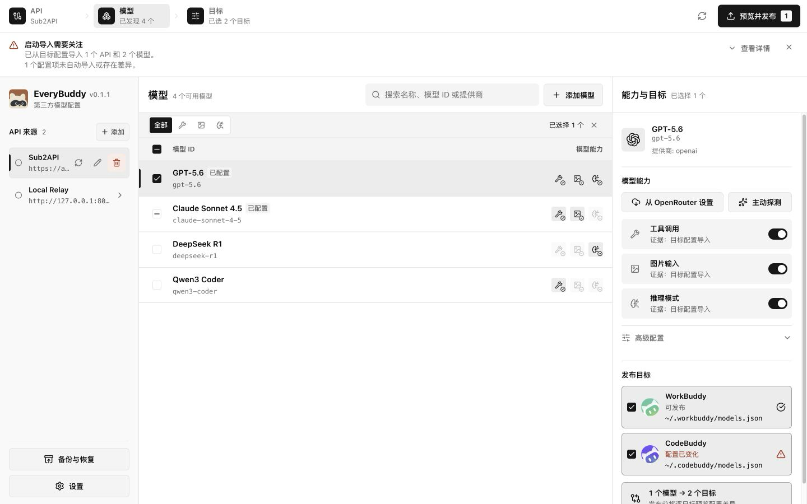

# EveryBuddy

EveryBuddy 是一个面向个人开发者的开源桌面应用，用于管理 OpenAI-compatible API，并把模型配置发布到 WorkBuddy、CodeBuddy 或同时发布到两个产品。

> 当前版本为 `0.1.0-alpha.1`。发布前会备份并校验目标配置，但仍建议先确认 WorkBuddy 和 CodeBuddy 的现有 `models.json` 已纳入本机备份。



## 功能

- 同时管理多个 API Base URL 和 Bearer Token。
- 远程 API 必须使用 HTTPS；HTTP 仅用于 `localhost`、`127.0.0.1` 和 `::1` 等 loopback 地址。
- 通过 `GET /v1/models` 发现模型，也可在指定 API 来源下手动添加模型。
- 使用 OpenRouter 公开模型目录匹配 Tool Call、Vision 和 Reasoning；无法匹配时回退 API metadata 和保守默认值。
- 完整配置 Tool Call、Vision、Reasoning、`supportedEfforts` 和高级模型参数。
- 启动时读取两个目标的现有配置，导入缺失的 API 来源并恢复模型选择状态。
- 分别发布到 WorkBuddy、CodeBuddy，或使用补偿式事务同时发布到两个目标。
- 发布前预览差异，保留未知字段，并提供 Drift 检测、原子写入、备份和恢复。
- 支持简体中文、English，以及 Light、Dark、System 主题。

## Token 安全边界

EveryBuddy 把 API Token 保存到 macOS Keychain 或 Windows Credential Manager，不把明文 Token 写入 SQLite、日志或前端持久化状态。

WorkBuddy 和 CodeBuddy 的 `models.json` 协议要求包含明文 `apiKey`。发布模型时，EveryBuddy 必须把 Token 写入对应配置文件：

| 平台    | WorkBuddy                              | CodeBuddy                              |
| ------- | -------------------------------------- | -------------------------------------- |
| macOS   | `~/.workbuddy/models.json`             | `~/.codebuddy/models.json`             |
| Windows | `%USERPROFILE%\.workbuddy\models.json` | `%USERPROFILE%\.codebuddy\models.json` |

不要把这些文件上传到 Git、网盘共享目录或诊断附件。详细边界见 [SECURITY.md](SECURITY.md)。

## 系统要求

- macOS 12 或更高版本，发布包同时支持 Apple Silicon 和 Intel。
- Windows 10 或更高版本，首版发布 x64 安装包。

Alpha 安装包由 [GitHub Releases](https://github.com/myxiaoao/everybuddy/releases) 提供。当前安装包没有 Apple Developer ID 或 Windows Authenticode 平台签名，因此 macOS Gatekeeper 和 Windows SmartScreen 会显示未验证开发者警告。

只从本仓库下载，并使用 Release 中的 `SHA256SUMS.txt` 校验文件。macOS 用户需要在 Finder 中对应用选择「打开」，或在「系统设置 → 隐私与安全性」中确认打开；Windows 用户需要在 SmartScreen 中选择「更多信息 → 仍要运行」。

Tauri Updater 资产仍使用独立 Ed25519 key 签名，更新客户端不会接受未通过签名校验的文件。GitHub 的 `releases/latest` 不会选择 Prerelease，因此 Alpha 阶段使用手动下载更新；稳定更新通道启用后再开放应用内自动更新。每个 Release 保留为 Draft，直到 Updater manifest、`.sig`、安装包和 SHA-256 校验全部通过。正式发行前仍需补充 Apple notarization 和 Windows Authenticode。

## 本地开发

前置条件：

- Node.js `22.12.0` 至 `24.x`。
- pnpm `11.22.0`。
- Rust `1.91.1`。仓库中的 `rust-toolchain.toml` 会安装 `rustfmt` 和 `clippy`。
- 当前平台的 [Tauri prerequisites](https://v2.tauri.app/start/prerequisites/)。

启动桌面应用：

```bash
pnpm install --frozen-lockfile
pnpm tauri dev
```

只启动浏览器 UI Demo：

```bash
pnpm dev
```

打开 `http://localhost:1420/?demo=1`。Demo 使用本地模拟数据，不访问目标配置、Gateway 或系统凭据库。

## 验证

```bash
pnpm format:check
pnpm lint
pnpm typecheck
pnpm ipc:check
pnpm test
pnpm test:coverage
pnpm build
pnpm release:check
cargo fmt --check --manifest-path src-tauri/Cargo.toml
cargo clippy --manifest-path src-tauri/Cargo.toml --all-targets --all-features -- -D warnings
cargo test --manifest-path src-tauri/Cargo.toml
pnpm tauri build
```

## 文档

- [技术设计](docs/TECHNICAL_DESIGN.md)
- [UI 设计](docs/UI_DESIGN.md)
- [安全策略](SECURITY.md)
- [故障排查](docs/TROUBLESHOOTING.md)
- [贡献指南](CONTRIBUTING.md)
- [发布流程](RELEASING.md)
- [变更记录](CHANGELOG.md)

## 项目声明

EveryBuddy 是非官方社区项目，与 WorkBuddy、CodeBuddy 及其开发者没有隶属或合作关系。文档和界面中出现的第三方产品名、商标和 Logo 归各自权利人所有。

## License

[MIT](LICENSE)
