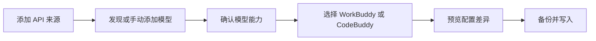
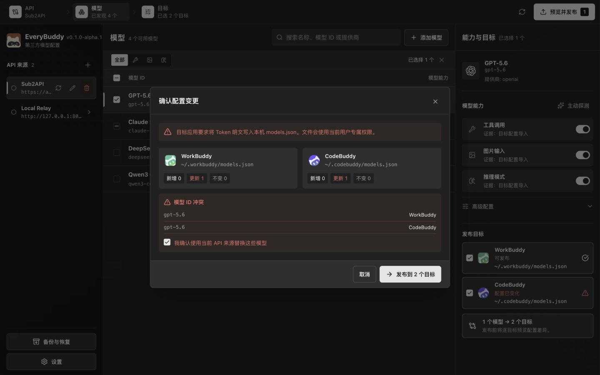

<div align="center">


# EveryBuddy

[](https://react.dev/) [](https://www.typescriptlang.org/) [](https://www.rust-lang.org/) [](https://tauri.app/) [](LICENSE)

**面向 WorkBuddy 与 CodeBuddy 的 OpenAI-compatible 模型配置管理桌面应用**

</div>

EveryBuddy 是一款面向个人开发者的开源桌面应用。它集中管理多个 OpenAI-compatible API 来源，再把选中的模型配置发布到 WorkBuddy、CodeBuddy 或两个目标。

> 当前稳定版本：`0.1.1`。EveryBuddy 会在发布前备份并校验目标配置，仍建议将现有 `models.json` 纳入本机备份。


## 能做什么

- 管理多个 API 来源，Token 保存到 EveryBuddy 的本地 SQLite 数据库。
- 通过 `GET /v1/models` 发现模型，也可以手动添加未返回的模型。
- 识别 Tool Call、Vision、Reasoning、Reasoning Effort 和常用模型参数。
- 从 OpenRouter 读取指定模型的公开信息，或通过主动 Probe 和人工设置补充能力。
- 分别发布到 WorkBuddy、CodeBuddy，或通过补偿式事务同时发布到两个目标。
- 发布前预览差异并检测外部改动，每个目标保留最近 10 份可恢复备份。
- 支持简体中文、English，以及 Light、Dark、System 主题。

## 使用流程



1. 添加 API Base URL 和 Bearer Token。
2. 发现模型，或在当前 API 来源下手动添加模型。
3. 检查模型能力与调用参数。可以采用自动解析结果、从 OpenRouter 设置、主动 Probe 或人工设置。
4. 选择模型和发布目标，确认新增、更新、移除与冲突后发布。
5. 每次启动时，EveryBuddy 都会重新读取 WorkBuddy 和 CodeBuddy 的 `models.json`。只有当前目标文件中存在并准确匹配的模型才显示「已配置」。

API 来源不存在时，应用会根据目标文件创建对应来源并导入模型。API 来源已经存在时，应用只重新匹配当前模型和发布选择，不覆盖本地模型配置。再次发布会移除确认属于当前 API 来源但未选中的模型，无法确认归属的本地或外部模型仍会保留。

## 下载安装

- macOS 12 或更高版本，发布包同时支持 Apple Silicon 和 Intel。
- Windows 10 或更高版本，提供 x64 安装包。

安装包可从 [GitHub Releases](https://github.com/myxiaoao/everybuddy/releases) 下载。安装包暂未使用 Apple Developer ID 或 Windows Authenticode 平台签名，macOS Gatekeeper 和 Windows SmartScreen 会显示未验证开发者警告。

只从本仓库下载安装包，并使用 Release 中的 `SHA256SUMS.txt` 校验文件：

- macOS：把 `EveryBuddy.app` 移动到「应用程序」目录后，先在 Finder 中对应用选择「打开」，或在「系统设置 → 隐私与安全性」中确认打开。如果 Gatekeeper 仍然阻止启动，并且已经完成 SHA-256 校验，执行：

  ```bash
  sudo xattr -cr "/Applications/EveryBuddy.app"
  open "/Applications/EveryBuddy.app"
  ```

  `xattr -cr` 会递归清除应用包的扩展属性。不要把命令目标改成 `/Applications` 或其他目录。

- Windows：在 SmartScreen 中选择「更多信息 → 仍要运行」。

Tauri Updater 资产使用独立 Ed25519 key 签名，更新客户端不会接受签名校验失败的文件。GitHub 的 `releases/latest` 指向最新稳定版本，应用可以检查并安装通过签名校验的更新。平台签名补齐前，更新后的应用仍可能触发 Gatekeeper 或 SmartScreen 警告。

## 模型能力

自动解析的 Evidence 优先级为：人工设置、成功的主动 Probe、已有目标配置的导入值、Gateway metadata、OpenRouter、保守默认值。Gateway 或 OpenRouter 明确标记为非 text-output 的模型不会生成聊天能力和调用参数。

模型发现和手动添加会按需读取 [OpenRouter 模型目录](https://openrouter.ai/api/v1/models?output_modalities=all)。只有目录中存在的模型才能使用「从 OpenRouter 设置」。确认匹配后，EveryBuddy 请求 `GET https://openrouter.ai/api/v1/model/{author}/{slug}`，用返回结果更新模型能力和参数，同时保留 `endpointOverride` 与 `useCustomProtocol`。

OpenRouter 请求不携带用户 Token、API Base URL 或 Gateway metadata。模型目录成功结果在本机缓存 6 小时，请求失败后 15 分钟内不重复请求。自动解析时，Gateway metadata 的明确字段优先，OpenRouter 只补充缺失字段。普通模型刷新不会覆盖已有 Target 导入配置或人工配置。

主动 Probe 只在确认后执行，一次最多发送 3 个最小请求，可能产生少量 Token 消耗。Custom Protocol 不执行基于 Chat Completions 的 Probe。Evidence、Reasoning、Alias 和 Canonical slug 的完整规则见 [技术设计](docs/TECHNICAL_DESIGN.md)。

## 发布目标

| 平台    | WorkBuddy                              | CodeBuddy                              |
| ------- | -------------------------------------- | -------------------------------------- |
| macOS   | `~/.workbuddy/models.json`             | `~/.codebuddy/models.json`             |
| Windows | `%USERPROFILE%\.workbuddy\models.json` | `%USERPROFILE%\.codebuddy\models.json` |

WorkBuddy 与 CodeBuddy 使用相同的模型序列化规则。发布后的显示名称采用 `API 来源名称 · 模型名称`，上游 Model ID 保持不变。双目标发布发生部分失败时，EveryBuddy 会恢复已经写入的目标，并分别报告结果。

EveryBuddy 支持模型数组和包含 `models` 数组的旧包装格式。更新已有模型时，应用会保留未知顶层字段、未知模型字段和未知 Reasoning 字段。写入前如果检测到其他程序修改了目标文件，本次发布会停止并要求重新加载差异。



## API 兼容要求

EveryBuddy 当前支持使用 Bearer Token 的 OpenAI-compatible API：

| 项目       | 要求                              |
| ---------- | --------------------------------- |
| 模型发现   | `GET {apiRoot}/models`            |
| 主动 Probe | `POST {apiRoot}/chat/completions` |
| 认证       | `Authorization: Bearer {token}`   |
| 远程 API   | 必须使用 HTTPS                    |
| 本机 API   | loopback 地址可以使用 HTTP        |

本机 loopback 地址包括 `localhost`、`127.0.0.1` 和 `::1`。API Base URL 可以填写域名根地址、`/v1` API Root 或完整的 `/v1/models` 地址，EveryBuddy 会统一转换为 API Root。当前版本不支持非 Bearer 认证，也不对非 OpenAI-compatible 协议作兼容承诺。

## Token 安全边界

EveryBuddy 会把明文 Token 写入本地 SQLite 数据库。Token 不会进入 Tauri IPC 返回值、前端持久化状态、模型 metadata、诊断日志或错误对象。WorkBuddy 和 CodeBuddy 的配置协议要求 `models.json` 包含明文 `apiKey`，发布模型时必须把 Token 写入目标配置，目标配置的备份也可能包含相同 Token。

不要把 EveryBuddy 数据库、目标配置、备份或未经检查的诊断日志提交到 Git、上传到公开附件，或存放在不受保护的同步目录。详细边界和日志位置见 [安全策略](SECURITY.md) 与 [故障排查](docs/TROUBLESHOOTING.md)。

## 本地开发

前置条件：

- Node.js `22.12.0` 至 `24.x`。
- pnpm `11.22.0`。
- Rust `1.91.1`。仓库中的 `rust-toolchain.toml` 会安装 `rustfmt` 和 `clippy`。
- 当前平台的 [Tauri prerequisites](https://v2.tauri.app/start/prerequisites/)。

启动桌面应用：

```bash
pnpm install --frozen-lockfile
pnpm tauri dev
```

只启动浏览器 UI Demo：

```bash
pnpm dev
```

打开 `http://localhost:1420/?demo=1`。Demo 使用本地模拟数据，不访问目标配置、API 或 EveryBuddy 持久化数据库。

验证完整代码库：

```bash
pnpm verify
pnpm tauri build
```

## 项目文档

- [技术设计](docs/TECHNICAL_DESIGN.md)
- [UI 设计](docs/UI_DESIGN.md)
- [安全策略](SECURITY.md)
- [故障排查](docs/TROUBLESHOOTING.md)
- [贡献指南](CONTRIBUTING.md)
- [发布流程](RELEASING.md)
- [变更记录](CHANGELOG.md)

## 项目声明

EveryBuddy 是非官方社区项目，与 WorkBuddy、CodeBuddy 及其开发者没有隶属或合作关系。文档和界面中出现的第三方产品名、商标和 Logo 归各自权利人所有。

## License

[MIT](LICENSE)
